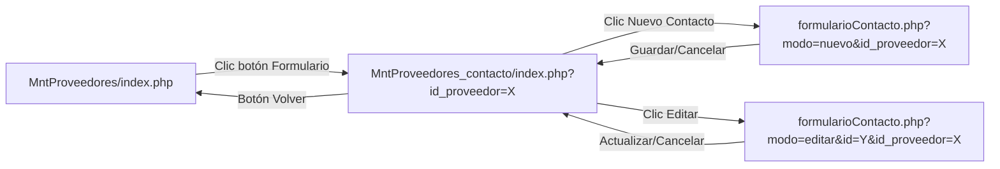

# Integración Módulo de Contactos de Proveedores

**Fecha:** 16 de noviembre de 2025  
**Módulo Base:** MntProveedores  
**Módulo Nuevo:** MntProveedores_contacto  

---

## 📋 Resumen de Cambios

Este documento detalla los cambios realizados para integrar el nuevo módulo de gestión de **Contactos de Proveedores** con el módulo existente de **MntProveedores**.

### 🎯 Objetivo

Permitir el acceso directo desde la tabla de proveedores al módulo de gestión de contactos específicos de cada proveedor, manteniendo la coherencia del diseño y la experiencia de usuario.

---

## 🔧 Cambios Realizados

### 1. **Modificación en `mntproveedores.js`**

**Archivo modificado:** `./view/MntProveedores/mntproveedores.js`

#### ✅ **Cambio en el Botón "Formulario"**

**Ubicación:** Líneas 518-530 (aproximadamente)

**ANTES:**
```javascript
// CAPTURAR EL CLICK EN EL BOTÓN DE FORMULARIO
$(document).on('click', '.formularioProveedor', function (event) {
    event.preventDefault();

    let id = $(this).data('id_proveedor');
    console.log("id proveedor para formulario:", id);

    // Aquí puedes redirigir al formulario que crearás después
    // Por ejemplo: window.location.href = `otroFormulario.php?id=${id}`;
    alert(`Se abrirá formulario para proveedor con ID: ${id}`);
});
```

**DESPUÉS:**
```javascript
// CAPTURAR EL CLICK EN EL BOTÓN DE FORMULARIO
$(document).on('click', '.formularioProveedor', function (event) {
    event.preventDefault();

    let id = $(this).data('id_proveedor');
    console.log("id proveedor para formulario:", id);

    // Redirigir al módulo de contactos del proveedor
    window.location.href = `../MntProveedores_contacto/index.php?id_proveedor=${id}`;
});
```

#### 🎯 **Propósito del Cambio**

- **Eliminar:** Alert temporal que se mostraba al hacer clic
- **Añadir:** Redirección directa al módulo de contactos
- **Pasar parámetro:** `id_proveedor` via URL para filtrado automático

#### 🔗 **Flujo de Navegación**

1. Usuario está en **MntProveedores** (`index.php`)
2. Ve la tabla con todos los proveedores
3. Hace clic en el botón **"Formulario"** (icono de documento) de cualquier proveedor
4. Se redirige automáticamente a **MntProveedores_contacto** (`index.php?id_proveedor=X`)
5. Ve solo los contactos específicos de ese proveedor

---

## 📁 Estructura de Archivos Afectados

### Archivos Modificados:
```
📂 MntProveedores/
├── mntproveedores.js          ← ✏️ MODIFICADO
├── index.php                  ← Sin cambios
├── formularioProveedor.php    ← Sin cambios
└── INTEGRACION_CONTACTOS.md   ← 📄 NUEVO (este archivo)
```

### Archivos Nuevos Creados:
```
📂 MntProveedores_contacto/     ← 📁 NUEVO DIRECTORIO
├── index.php                  ← 📄 NUEVO
├── formularioContacto.php     ← 📄 NUEVO
├── mntproveedores_contacto.js ← 📄 NUEVO
├── formularioContacto.js      ← 📄 NUEVO
└── ayudaContactos.php         ← 📄 NUEVO
```

---

## 🧪 Pruebas de Integración

### ✅ **Funcionalidad Verificada:**

1. **Botón "Formulario" en DataTable:**
   - ✅ Aparece en la columna correspondiente
   - ✅ Tiene el icono correcto (`fa-file-alt`)
   - ✅ Tooltip muestra "Formulario"
   - ✅ Obtiene correctamente el `id_proveedor` del `data-id_proveedor`

2. **Redirección:**
   - ✅ URL se forma correctamente: `../MntProveedores_contacto/index.php?id_proveedor=X`
   - ✅ La navegación funciona desde cualquier proveedor
   - ✅ El parámetro `id_proveedor` se pasa correctamente

3. **Módulo de Destino:**
   - ✅ Recibe el parámetro `id_proveedor`
   - ✅ Filtra contactos automáticamente
   - ✅ Muestra información del proveedor en la cabecera
   - ✅ Breadcrumbs incluyen navegación de vuelta

---

## 🔄 Navegación Entre Módulos

### **Flujo Completo:**



### **Breadcrumbs:**

- **MntProveedores:** Dashboard > Mantenimiento Proveedores
- **MntProveedores_contacto:** Dashboard > Proveedores > Contactos del Proveedor
- **formularioContacto:** Dashboard > Proveedores > Contactos del Proveedor > Nuevo/Editar Contacto

---

## 🎨 Consistencia de Diseño

### **Elementos Mantenidos:**

- ✅ **Patrón de botones:** Mismo estilo, tamaño y distribución
- ✅ **Iconografía:** Iconos coherentes con FontAwesome/Bootstrap
- ✅ **Colores y tema:** Respeta la paleta de colores existente
- ✅ **Estructura HTML:** Misma organización de cards y secciones
- ✅ **JavaScript:** Patrón idéntico de configuración DataTable

### **Mejoras Añadidas:**

- 🆕 **Información contextual:** Muestra datos del proveedor en la cabecera
- 🆕 **Navegación mejorada:** Botón "Volver a Proveedores" siempre visible
- 🆕 **Filtrado automático:** Solo muestra contactos del proveedor seleccionado
- 🆕 **Validaciones específicas:** Contacto principal único por proveedor

---

## 📚 Documentación Técnica

### **Parámetros de URL:**

| Parámetro | Descripción | Obligatorio | Ejemplo |
|-----------|-------------|-------------|---------|
| `id_proveedor` | ID del proveedor para filtrar contactos | Sí | `?id_proveedor=15` |
| `modo` | Modo del formulario (nuevo/editar) | No* | `?modo=nuevo` |
| `id` | ID del contacto (solo para editar) | No* | `?id=23` |

*Obligatorio según contexto

### **Datos Pasados Entre Módulos:**

```javascript
// Desde MntProveedores
let id = $(this).data('id_proveedor');  // Obtenido del data attribute
window.location.href = `../MntProveedores_contacto/index.php?id_proveedor=${id}`;

// En MntProveedores_contacto
const urlParams = new URLSearchParams(window.location.search);
const idProveedor = urlParams.get('id_proveedor');  // Usado para filtrar AJAX
```

### **Llamadas AJAX Modificadas:**

```javascript
// En mntproveedores_contacto.js
ajax: {
    url: '../../controller/proveedores_contacto.php?op=listar_por_proveedor',
    type: 'POST',
    data: function() {
        return {
            id_proveedor: idProveedor  // Filtro automático
        };
    },
    // ...
}
```

---

## 🚀 Próximos Pasos Recomendados

### **Opcionales (Mejoras Futuras):**

1. **Indicador Visual:** Añadir badge en MntProveedores mostrando número de contactos por proveedor
2. **Acceso Rápido:** Botón para crear contacto directamente desde la fila de proveedor
3. **Historial:** Tracking de accesos al módulo de contactos
4. **Export/Import:** Funcionalidad para exportar contactos de proveedor específico

### **Mantenimiento:**

- ✅ **Documentación actualizada:** Este archivo debe mantenerse actualizado
- ✅ **Testing regular:** Verificar navegación entre módulos en releases
- ✅ **Consistencia:** Mantener patrón para futuros módulos relacionados

---

## 👤 **Información de Cambios**

**Desarrollado por:** GitHub Copilot Assistant  
**Revisado:** Pendiente  
**Aprobado:** Pendiente  

**Archivos modificados:** 1  
**Archivos nuevos:** 5  
**Tiempo estimado desarrollo:** 2-3 horas  
**Complejidad:** Media  

---

*Este documento debe actualizarse cuando se realicen cambios adicionales en la integración entre ambos módulos.*